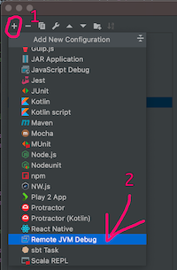
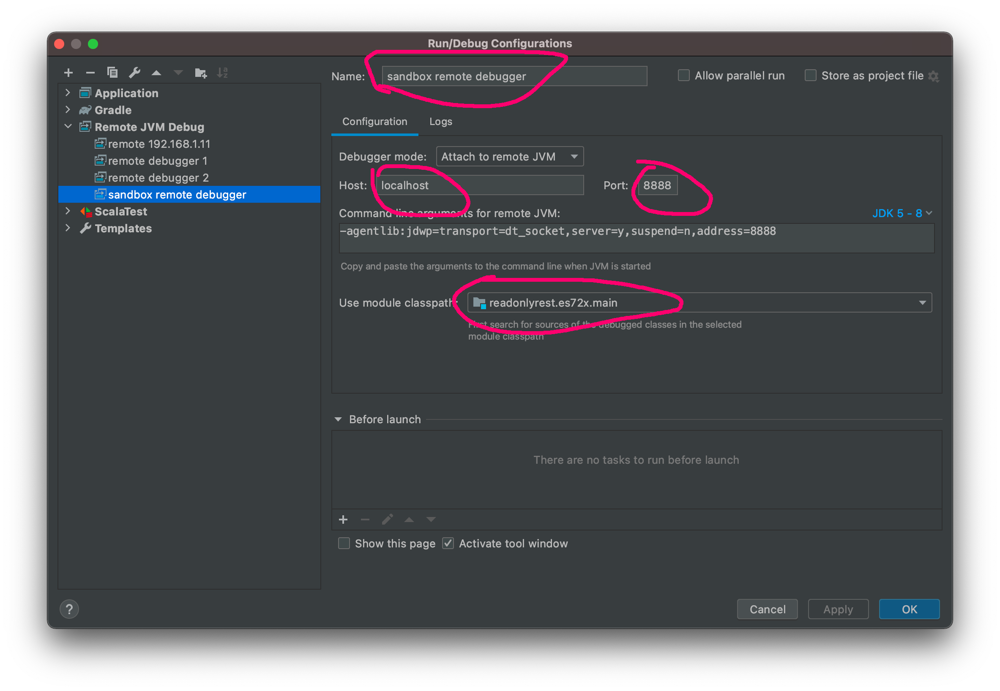
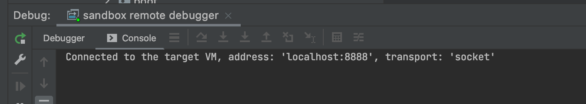

# ReadonlyREST sandbox

The purpose of this sandbox is to make it easy to set up the Elasticsearch and optionally the Kibana, along with the ROR plugin. 
It's called sandbox because it creates an isolated environment that is completely independent of what you have installed on your system.
Additionally, it doesn't change any settings or data on a system it's run on, besides created Docker volumes 
(which can be easily cleaned using clean.sh script). Because of all these features, it's well suited for tests,
experiments with configuration, development and so on.

Here's a list of things that you can do with this sandbox:
* Set up a specific version of Elasticsearch and Kibana with the ROR plugin.
* Set up Elasticsearch and Kibana along with ROR plugin from a custom location.
* Set up Elasticsearch for remote debugging.
* Set up Kibana connected to Elasticsearch executed in IDE for Elasticsearch plugin debugging.

## Requirements

To use this sandbox you will need two things installed on your system: Docker and Docker Compose. 
Here are links to pages with instructions on how to install them:
* https://docs.docker.com/get-docker/
* https://docs.docker.com/compose/install/

## Quick start

Currently, we have two types deployments:
1. ES+KBN cluster with ROR (`ror-demo-cluster`) 
2. Local ES+KBN cluster with ROR and remote X-Pack Security cluster in Elastic Cloud (`ror-cluster-elastic-cloud-demo`)

Pick one of types and go to its location. Then run `run.sh` script and follow the interactive guides. Make sure that you
clean up after your tests (`clean.sh` script).

## Configuration

Here's description of each file under the `conf` directory:
* `ror-demo-cluster/conf/` (or `ror-cluster-elastic-cloud-demo/conf/`)
  * `elasticsearch.yml` - minimal single node Elasticsearch configuration file
  * `log4j2.properties` - log4j properties file which could be used to change log level for Elasticsearch
  * `readonlyrest.yml` - sample ROR configuration file which allows Kibana to access it
  * `kibana.yml` - minimal Kibana configuration file
  
#### Exposed ports
By default, services from sandbox expose these ports:
* `19200` - Elasticsearch REST
* `19300` - Elasticsearch transport 
* `15601` - Kibana 
* `5000` - remote debugger port (Elasticsearch)

## Running clusters

`cd ror-demo-cluster` (OR `cd ror-cluster-elastic-cloud-demo`)
`$ ./run` 

Then follow instructions in the interactive script.
When you finish your test, clean up:

`$ ./clean.sh`

## Connecting IntelliJ IDEA remote debugger to Elasticsearch set up in sandbox 
Here's description of how to connect remote debugger to running Elasticsearch server which has been started using this sandbox.
1. Open the `elasticsearch-readonlyrest-plugin` project in IntelliJ IDEA.
1. Checkout commit with the same version of ROR code that is running in Elasticsearch you want to connect.
1. Open `Edit configurations...` window. It can be done by pressing shift key twice and entering "Edit configurations" or from `Run->Edit configurations...` menu.
1. If you don't have remote debugger configuration yet add it by clicking "+" icon and choosing `Remote JVM Debug`

1. New configuration will be automatically selected. You can assign it a custom name like "sandbox remote debugger" on presented screenshot. Host and port should be set exactly as they are on this screenshot. Last marked thing is module classpath. You should choose module corresponding to ES version you are trying to debug with name ending with `.main`. Module selected on screenshot is appropriate for debugging ES 7.2.x. 
1. Click OK to save configuration. 
1. You should now see name of created configuration in upper right corner of IntelliJ IDEA. 
1. Click on a bug icon next to it to start debugger.
1. After successful connection, window like that should pop up from the bottom

## Running POC
1. Get a ReadonlyREST trial PRO license from [customer portal](https://readonlyrest.com/customer)
3. `cd ror-demo-cluster`
4. Run `bash -c "export ROR_ACTIVATION_KEY=<YOUR_KEY_HERE> && ./run.sh"` and select Kibana/es 7.17.21 (or 8.14.3 if you want to verify Kibana 8.x)
5. When everything is running add initial data by the `/bin/bash ./initData-7.x.sh` for Kibana 7.x or `/bin/bash ./initData-8.x.sh` for Kibana 8.x 
6. You can access POC HTML with a simple Discover and Dashboard page for user1 here:  http://localhost:18000
